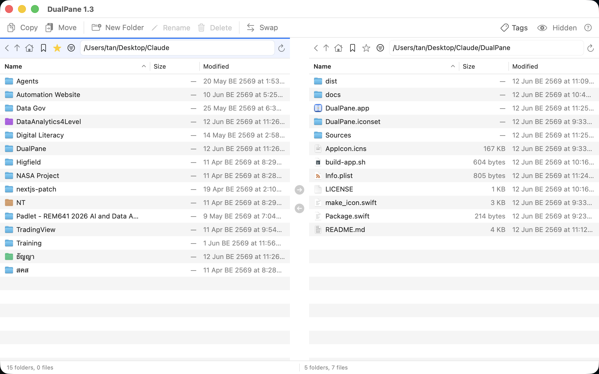

# DualPane

A simple, fast, two-pane file manager for macOS — inspired by classic dual-pane
managers like [xplorer²](https://www.zabkat.com/) and Norton Commander, built
natively with Swift, SwiftUI, and AppKit.



## Features

- **Two independent panes** side by side, each with its own folder, path bar, and history
- **Native performance** — the file lists are AppKit `NSTableView`s (the same control Finder uses), so selection and scrolling are instant even in large folders
- **Copy / Move between panes** with one click or shortcut (⌘D copy, ⌘M move), or the **→ / ← transfer arrows** between the panes (with progress spinner; copied files are highlighted in the destination)
- **Drag & drop** — between panes, and to/from Finder (multi-file supported)
- **System clipboard integration** — ⌘C copy, ⌘X cut, ⌘V paste; works both ways with Finder
- **Finder tags** — apply color tags from the Tags menu (written as real Finder tags); tagged folders show **tinted folder icons**, tagged files show a color dot
- **Tag filter** — the funnel button in each pane lists every item with a chosen tag color across your whole Home folder (Spotlight-backed, like Finder's tag sidebar)
- **Favorites** — bookmark folders with the ★ button and jump to them from the 🔖 menu in either pane (persisted between launches)
- **Remembers your folders** — each pane reopens in the folder you left it in last time
- **File operations** — New Folder (⌘N), Rename (⌘R), Delete to Trash (⌘⌫) with confirmation
- **Navigation** — Back, Up, Home buttons; editable path bar with `~` expansion; double-click or Return to open
- **Sortable columns** (Name / Size / Modified), folders listed first, real file icons
- **Extras** — swap panes, show hidden files toggle, per-pane status bar with selection size, About/changelog window (Help menu or ⌘?)

## Supported platforms

| | |
|---|---|
| **OS** | macOS 13 Ventura or later (tested on macOS 26) |
| **CPU** | Apple Silicon (M1–M4) — prebuilt download. Intel Macs: build from source (see below) |

## Install

### Option 1 — Download (Apple Silicon)

1. Download the latest `DualPane-x.y.dmg` from the [Releases](https://github.com/tanlull/DualPane/releases) page.
2. Open the DMG and drag **DualPane** into the **Applications** folder.
3. First launch only: **right-click DualPane.app → Open → Open**.
   (The app is not notarized with Apple, so macOS shows a one-time
   "unverified developer" warning. If you don't see the Open option, go to
   *System Settings → Privacy & Security → Open Anyway*.)

### Option 2 — Build from source (Apple Silicon or Intel)

Requires Xcode Command Line Tools (`xcode-select --install`) with Swift 5.9+.

```bash
git clone https://github.com/tanlull/DualPane.git
cd DualPane
./build-app.sh
open DualPane.app
```

The script compiles a release build, generates the app icon, and assembles a
signed (ad-hoc) `DualPane.app` you can copy into `/Applications`.

## Keyboard shortcuts

| Shortcut | Action |
|---|---|
| ⌘D | Copy selection to the other pane |
| ⌘M | Move selection to the other pane |
| ⌘C / ⌘X / ⌘V | Copy / Cut / Paste via system clipboard |
| ⌘N | New folder in active pane |
| ⌘R | Rename selected item |
| ⌘⌫ | Move selection to Trash |
| ⌘A | Select all in active pane |
| Return / Enter | Open selected file or folder |
| ⌘? | Help / About / changelog |

The *active* pane (target of all operations) is marked with a blue stripe on top —
just click in a pane to activate it.

## Project layout

```
Sources/
  DualPaneApp.swift    App entry point, menu bar commands
  ContentView.swift    Window layout, toolbar, file operations, tags
  FileTableView.swift  Native NSTableView pane (selection, drag & drop, menus)
  FileModel.swift      Pane state: listing, navigation, sorting, tag search
  FavoritesStore.swift Persistent folder bookmarks
  AboutView.swift      About window, version info, changelog
make_icon.swift        Generates the app icon programmatically
build-app.sh           One-step build + .app packaging script
```

## Changelog

See **Help → What's New (Changelog)** inside the app, or the
[Releases](https://github.com/tanlull/DualPane/releases) page.

## License

MIT — see [LICENSE](LICENSE).
